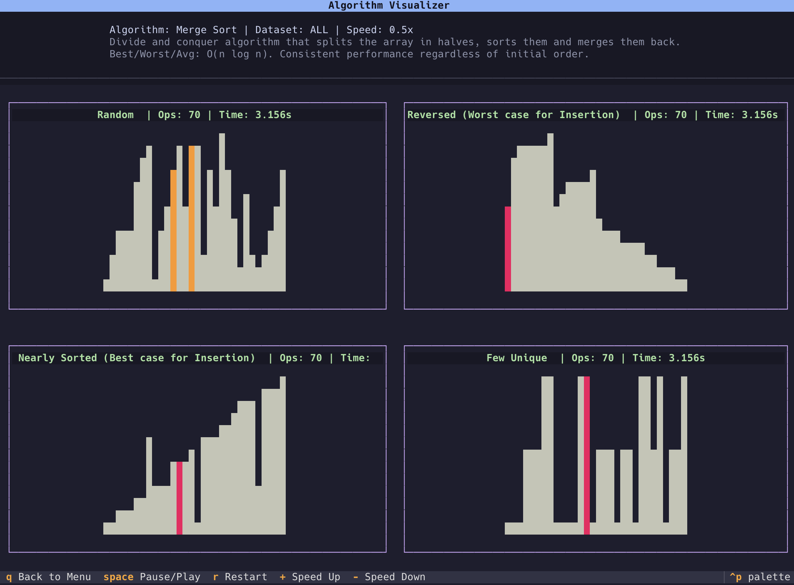

# Algorithm Visualizer

A terminal-based AI slop sorting algorithm visualizer built with [Textual](https://textual.textualize.io/).

Played around with Google Antigravity and Google Gemini 3.1. Pro to see how good it is at one-shotting an algorithm visualizer. It was pretty good I'd say.

## Features
- **Algorithms**: Bubble Sort, Selection Sort, Insertion Sort, Merge Sort, Quick Sort.
- **Datasets**: Random, Reversed, Nearly Sorted, Few Unique.
- **UI**: Modern TUI with Vim (`j`, `k`, `enter`) bindings and real-time visualization.

## Usage
Ensure you have `uv` installed, then run:

```bash
uv run python src/main.py
```



## Documentation
See [ARCHITECTURE.md](ARCHITECTURE.md) for details on the project structure, design patterns used, and how to add new algorithms or datasets.
